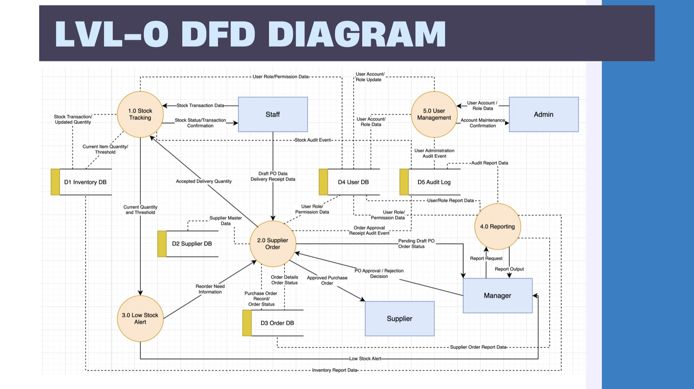
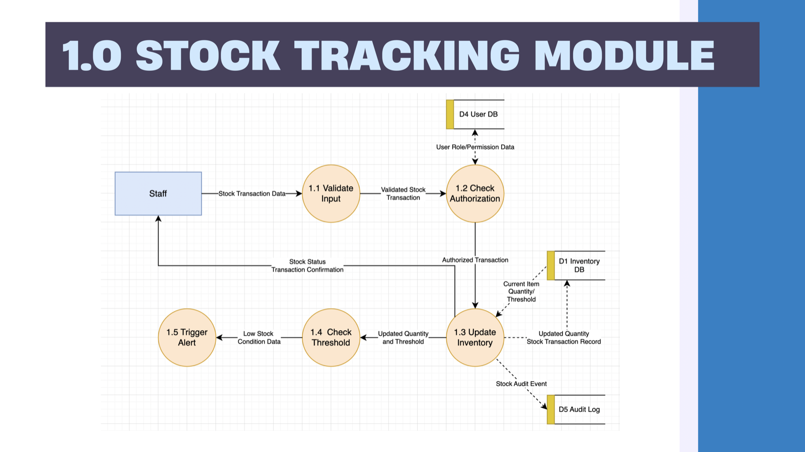
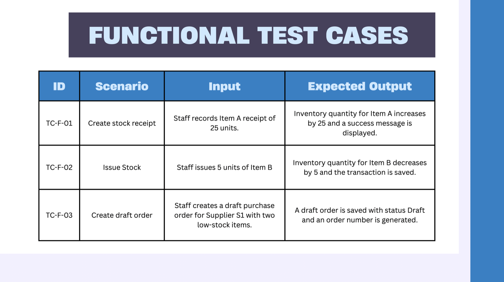

# 📦 Inventory & Supplier Management System — Architecture & QA

A full system analysis and QA plan for an enterprise **Inventory & Supplier Management System**,
produced for my Systems Analysis & Design coursework. It walks through SDLC planning end to end —
from scope and requirements through leveled data flow diagrams to a functional QA testing strategy.

📄 **[Read the full analysis (PDF)](./Inventory%20and%20Supplier%20management%20system.pdf)**

## 🗺 System Design — Data Flow Diagrams

**Level-0 DFD** — the whole system: 5 processes, 5 data stores, and 4 external entities (Staff,
Admin, Manager, Supplier) with every data flow between them.

**Level-1 DFD — Stock Tracking Module** — decomposing process 1.0 into validation, authorization,
inventory update, threshold check, and alerting.

## 🧪 Quality Assurance — Functional Test Cases

Structured, ID'd test cases with defined inputs and expected outputs — the basis of the QA strategy.

## 🔍 What's Inside
- **Scope & Requirements** — problem definition, project scope, functional & non-functional requirements
- **System Modules** — Stock Tracking, Supplier Orders, Low-Stock Alerts, Reporting, User Management
- **Data Flow Diagrams (DFDs)** — leveled DFDs (L0 + L1) mapping data movement across the system
- **QA Strategy** — functional test cases, ambiguity/conflict analysis, and defect-reporting format

## 🛠 Skills Demonstrated
`Systems Analysis & Design` · `Data Flow Diagrams (DFD)` · `Requirements Engineering` · `QA Testing` · `SDLC Planning`

## 👤 Role
Group coursework project. I led the majority of the analysis — defining the system scope and
requirements, modelling the system, and designing **both data flow diagrams** (the Level-0 system
DFD and the Stock Tracking module DFD) — and produced the full presentation deck. The functional
test-case suite was contributed by a teammate.
